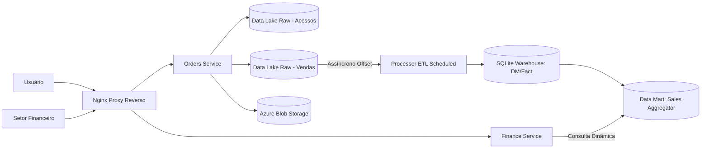

# Relatório Técnico - Scale-to-Insight

Este relatório apresenta o projeto Scale-to-Insight, desenvolvido para migrar a arquitetura monolítica de uma startup de e-commerce para um modelo moderno, distribuído e orientado a eventos. Com o aumento do tráfego, a solução separa as operações de ingestão, processamento de dados e exposição de indicadores. Isso garante uma base escalável e resiliente, entregando inteligência de negócio em tempo quase real para o setor financeiro.

## 1. Objetivo Técnico e Escopo

O objetivo é implementar uma arquitetura eficiente para ingestão e análise de dados de vendas. A solução prioriza a escalabilidade e a separação de responsabilidades em microserviços. Os serviços foram implementados com Quarkus 3, mantendo o fluxo de dados claro e auditável e a operação local via Docker para facilitar testes e avaliações.

## 2. Requisitos Funcionais Cobertos

1. Divisão do monolito em serviços conteinerizados independentes.
2. Uso do Nginx como API Gateway para rotear e gerenciar o tráfego externo.
3. Simulação de ambiente Cloud (Azure Blob Storage) usando Azurite.
4. Implementação de um pipeline de fluxo completo: Origem -> Processamento -> Destino.
5. Criação de um Data Lake (Raw) para persistência inicial de logs de acessos e vendas.
6. Modelagem de Data Warehouse (Fatos e Dimensões) e um Data Mart focado em performance de vendas.
7. Automação de CI/CD para deploy e testes de integração de fluxo via GitHub Actions.

## 3. Decisões Arquiteturais e Justificativas

### 3.1 Segmentação de Serviços Baseada em Responsabilidades
O ecossistema foi dividido em três frentes: o **Orders Service** (ingestão de pedidos), o **Finance Service** (leitura de KPIs e métricas) e o **Processor** (motor assíncrono de ETL).
Essa estrutura reduz o longo acoplamento entre a gravação transacional rápida da venda e os pesados cálculos analíticos, permitindo que cada área da ferramenta escale recursos de rede e memória de forma independente (Padrão CQRS).

### 3.2 Utilização do Nginx como API Gateway
O Nginx atua como porto de entrada exclusivo para todas as requisições externas. 
Com essa decisão, o roteamento da rede interna se torna centralizado, o que flexibiliza o contrato da API com o cliente. Caso ocorra a multiplicação (escalonamento) dos contêineres do banco ou das instâncias backend na nuvem, o usuário externo sequer percebe atualizações complexas nas rotas.

### 3.3 Construção de Data Lake Raw (JSONL + Emulação Azure)
Os logs brutos (Raw) são formados e salvos localmente num formato estrito JSONL (JSON Lines) e concomitantemente submetidos como Blobs textuais para o sistema Azurite.
A adoção do JSONL é devida à facilidade nas ações de empilhamento de fluxo contínuo (*append-only*), além de facilitar o reprocessamento seguro numa janela local. O papel ativo do Azurite é estritamente homologar o nosso uso dos SDKs da nuvem Azure, assegurando que, na ida para a Cloud paga, não serão necessários remendos no código.

### 3.4 Processamento e Persistência em Banco (SQLite)
A formatação estruturada do Data Warehouse e seu resumo (Data Mart) residem integrados em banco SQLite.
Sendo uma prova prática acadêmica, a opção embutida relacional SQLite torna-se uma das atitudes mais pragmáticas e isentas de instalação. A linguagem SQL processa nativamente todas as junções exigentes espaciais e somatórias para construir o esquema estrela do modelo, embora reconheça-se facilmente que não serviria numa esteira paralela massiva (sendo as opções ideais bancos como o Snowflake ou Redshift em ambiente On Demand).

### 3.5 Evolução do Controle Baseada em Schedulers
A rotina programada de ETL no motor processador utiliza o agendador do Quarkus (`@Scheduled`), substituindo a necessidade de laços manuais com espera bloqueante.
Esse modelo reduz complexidade operacional, evita concorrência indevida no ciclo ETL (com configuração para execução não concorrente) e mantém o processo previsível em cenários de desligamento e reinício de contêineres.

### 3.6 Adoção de Quarkus nos Serviços
A migração para Quarkus 3 trouxe padronização de desenvolvimento e operação nos três serviços.

- **API REST com JAX-RS**: endpoints implementados com `@Path`, `@GET` e `@POST`.
- **Configuração externa**: uso de `@ConfigProperty` para parâmetros de ambiente e execução.
- **Empacotamento padronizado**: build Maven com plugin Quarkus e execução via `quarkus-run.jar`.
- **Ciclo ETL com scheduler declarativo**: agendamento no processor por meio de propriedades, sem loop manual.

## 4. Modelagem de Dados Analítica

### 4.1 Camada Raw (Data Lake)
Diretórios efêmeros que garantem armazenamento primário intacto via append:
- `data/raw/access/events.jsonl` (Tráfego do cliente)
- `data/raw/sales/events.jsonl` (Eventos consumados)

### 4.2 Camada de Consolidação (Data Warehouse)
Esquema relacional em cruzamento dimensional (Star Schema/Snowflake):
- `dim_date` (Dimensão Temporal: base de tempo separando Mês/Ano/Dia)
- `fact_sales` (Fatos de eventos portando valores e amarras relacionais do pedido)

### 4.3 Camada de Exposição (Data Mart)
Agregador resumido exclusivo com viés para o usuário logista/diretoria:
- `dm_sales_performance` (Sumarização final da tabela contendo `total_sales`, `total_orders`, e `avg_ticket`).

## 5. Fluxograma Operacional

1. As solicitações do usuário ou do Gateway Financeiro chegam ao bloqueio do **Nginx** na porta 80.
2. Compras concretizadas via POST invadem o escopo reservado do **Orders Service**.
3. A venda adquire rastro imutável sendo copiada no **Data Lake Local (Raw JSONL)** e também replicada em blob pelo **Azure**.
4. O componente background **Processor**, ditado por seu scheduler interno, liga em intervalos curtos pré-agendados varrendo seu backlog.
5. Em conformidade com o ponteiro local, o mesmo insere os fatos da venda atualizada integrando tabelas Fato e Dimensão nas hierarquias de Storage do Warehouse.
6. A cada ciclo extraído, o subproduto focado (Data Mart de performance) sofre recalculamento em lote se adaptando aos novos resultados absolutos.
7. Requisições na Interface chegam de forma estática ao **Finance Service**, listando de maneira ultra leve o espelho do final deste Data Mart preenchido.

## 6. Qualidade, Testabilidade e Integração (CI/CD)

Como padrão da indústria, o pipeline `.github/workflows/ci-cd.yml` garante a homologação através de blocos concisos que testam todo o processo:
- **Build Efetivo**: Compila os serviços Quarkus e valida a conteinerização completa com Docker Compose.
- **Deploy Simulado**: sobe os contêineres em background para validar inicialização integrada do ecossistema.
- **Smoke Tests Completos**: executa health checks, publica venda de exemplo e valida o endpoint de KPIs após o ciclo ETL.

## 7. Apontamentos e Limitações

A complexidade delimitou algumas bordas que precisariam de escala técnica externa com orçamento e mão-de-obra real numa empresa:
1. Arquitetura simplória que não carrega *Identity Providers* em camadas externas perante cibersegurança e limites restritos de requisição.
2. Acoplamento brando no envio serial de mensagens (Injeções diretas aos blobs); O correto em altos fluxos na Startup futura usaria Broker Queueing como o RabbitMQ para mitigar pressão pesada (Backpressure).
3. Processos *Full-refresh* nas tabelas dimensionais substituindo todo o espelho para não causar anomalias transacionais; futuramente em Big Datas, usar modelagens incrementais com Delta Saves/Logs de mutação.

## 8. Diagrama de Rede, Atores e Componentes Lógicos

